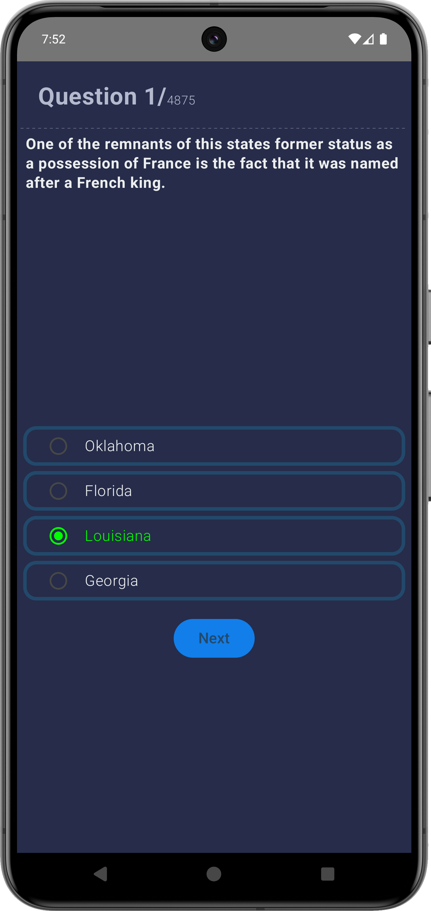
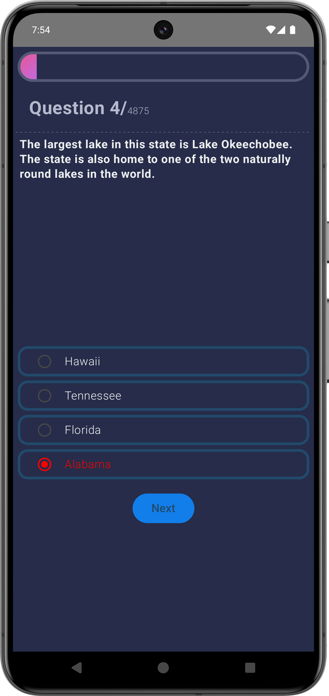
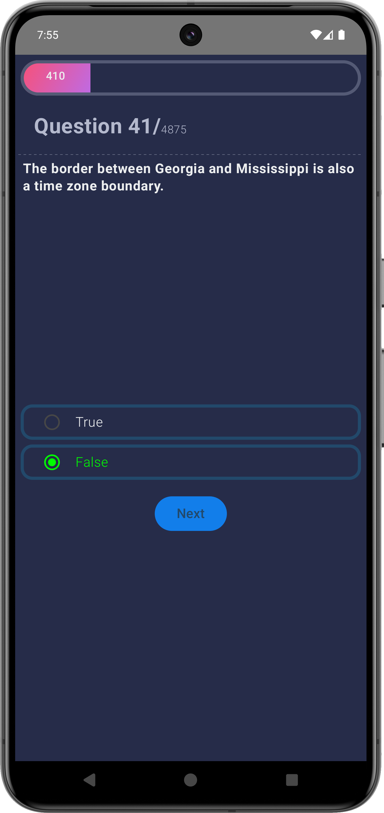
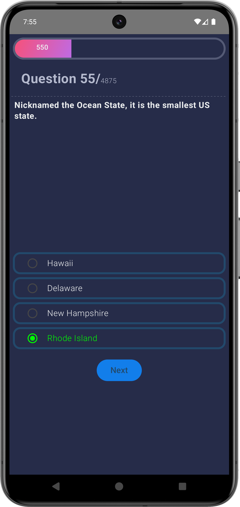

# Jet Trivia - Dynamic Quiz Application | [Website](https://ritikraaj77.github.io/WhisperBox/)

## Introduction

Jet Trivia is an engaging and dynamic quiz application designed to enhance learning and entertainment. The app enables users to create trivia questions, select answers, and generate JSON files for seamless integration.

## Key Features
- Custom question creation allowing users to input questions, options, and correct answers
- Automatic JSON export for structured and easy-to-share trivia data
- Modern UI/UX built with Jetpack Compose for an intuitive user experience
- Real-time validation to ensure input accuracy
- Streamlined workflow for trivia creation and JSON export

## Media Gallery

<!-- 2x3 Grid with Video and Images -->
<table style="width:100%;">
  <tr>
    <!-- First row: video + 2 images -->
    <td style="padding: 10px;">
      
    </td>
    <td style="padding: 10px;">
      
    </td>
    <td style="padding: 10px;">
      
    </td>
  </tr>
  <tr>
    <!-- Second row: 3 images -->
    <td style="padding: 10px;">
      
    </td>
    <td style="padding: 10px;">
      
    </td>
    <td style="padding: 10px;">
      
    </td>
  </tr>
</table>

## Technical Details
- **Architecture**: MVVM (Model-View-ViewModel) for scalable and maintainable code
- **UI Framework**: Jetpack Compose for declarative and responsive UI design
- **JSON Handling**: Gson library for efficient JSON parsing and creation
- **State Management**: Jetpack ViewModel and LiveData for real-time updates
- **Navigation**: Jetpack Navigation Component for seamless navigation between screens

## Tools & Libraries
- **Languages**: Kotlin
- **Data Handling**: Gson for JSON operations
- **UI/UX**: Jetpack Compose, Material Design
- **Navigation**: Jetpack Navigation Component

## Outcomes
- Successfully developed an intuitive trivia app with real-time JSON generation
- Showcased expertise in Jetpack Compose and modern Android UI design principles
- Gained hands-on experience in managing app state and data integrity

## Key Challenges & Solutions
- **Challenge**: Ensuring JSON objects are generated accurately
  - **Solution**: Implemented thorough input validation and used Gson for structured parsing
- **Challenge**: Designing a seamless UI for trivia creation
  - **Solution**: Leveraged Jetpack Compose to build a clean and responsive interface

## Future Enhancements
- Adding multi-user collaboration for shared trivia creation
- Integrating Firebase for storing and sharing trivia sets
- Introducing themed templates for a more customizable user experience
